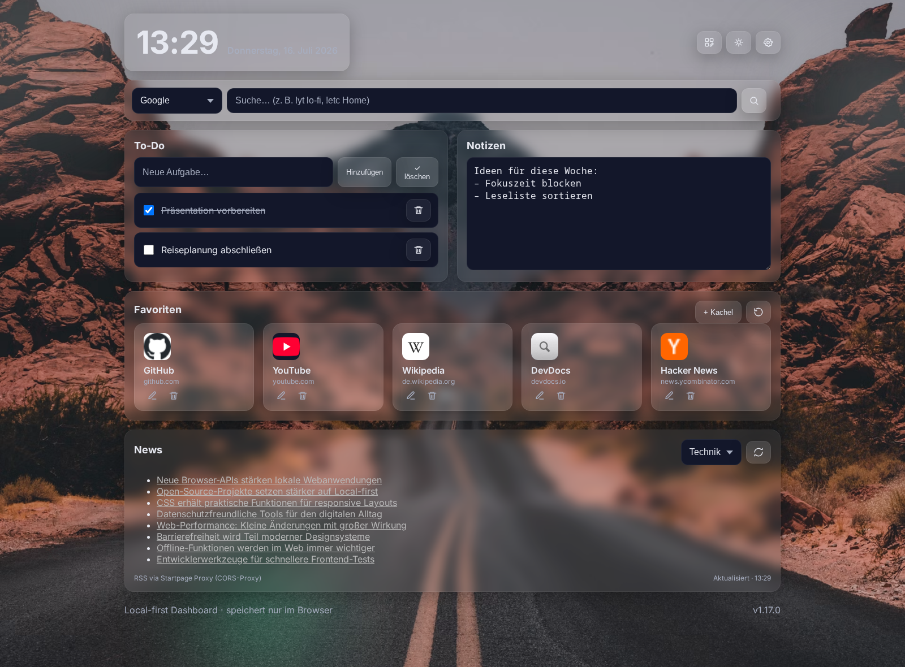



# Startpage

## Overview
Startpage is a **local-first browser start page** designed to replace the traditional new tab with a personal dashboard you fully control.

Configuration and personal content stay in the browser without accounts or tracking. Network widgets only contact their documented data providers; transport and RSS use the Startpage proxy to handle browser API restrictions.

Version: **v1.17.2** · Live: https://julianverse.de/startpage/

## Core Features
- Quick search: Multiple engines, bang shortcuts (`!g`, `!ddg`, `!bing`, `!sx`, `!yt`, `!wiki`, `!maps`), custom shortcuts, and autocomplete (bangs, shortcuts, recent searches, global wordlist + preset wordlist).
- Background engine: Presets, uploads, collections, rotation (time/theme/interval), quick actions (random, undo, lock), automatic accent color extraction, and IndexedDB-backed image storage.
- Favorite tiles: Drag and drop, quick access keys `1-9`, and reset to defaults.
- To-do and notes: Persistent to-do list and notes field.
- Weather: Multiple cities with quick city chips (switch/remove), current weather + min/max, and a rolling 24-hour forecast in 3-hour steps via Open-Meteo.
- Transport: Station search, departures, delay handling, retry states, and a configurable default station via the Startpage proxy for transport.rest.
- News: RSS reader with default and custom feeds via the Startpage RSS proxy; the list adapts to the selected widget height (4/8/16 entries).
- Resilient data widgets: Weather, transport, and news keep timestamped browser caches for offline/error fallback. Hidden widgets defer their network requests until enabled.
- Recent actions and system status: History chips plus browser info (RAM, CPU cores, network type).
- Setup assistant: Modern onboarding with direct preset tiles, theme/style + background, search engine, widgets + transport default, and one weather city (skippable and restartable).
- Visual widget editor: Toggle an on-dashboard editing mode, drag and drop widgets, and change card width or height directly. Editing controls disappear when the mode is closed.
- Layout and styling: Dark/Light/Auto theme, card styles (glass, solid, transparent, soft minimal), widget colors, dedicated header/search colors, and a "Tint widgets" action.
- Command palette: `Ctrl/Cmd+K` for quick actions across settings, themes, widgets, data export/import, presets, and profiles.
- Profiles: Named local snapshots of the full Startpage setup with create, rename, update, delete, apply, header quick switcher, and command palette support.
- Data: Scoped JSON export/import with selection dialogs, import replace/merge modes, and data presets from `assets/presets/` (starter, coding, gaming, minimal, productivity, reading, art, privacy, student, finance). Transfers are restricted to Startpage-owned storage keys, and local user presets in `assets/user-presets/` are auto-detected.
- Accessibility and safety: Labelled modal dialogs, focus trapping/restoration, keyboard ordering, safe external URL handling, and text-only rendering for untrusted feed content.
- Optional local Agent: An opt-in Ollama chat is available but disabled by default and is not required for any dashboard feature.

## Project Structure
- `index.html` - Main markup and ordered script includes.
- `scripts/` - Browser scripts split by feature area.
- `style.css` - Main styles.
- `assets/` - Optional assets (wordlists, images, presets, i18n files).
- `tests/` - Playwright browser smoke tests.
- `package.json` / `playwright.config.js` - Test tooling; the application itself still has no build step.
- `LICENSE` - MIT license for the project code and documentation.
- `THIRD_PARTY_NOTICES.md` - Licenses and notices for bundled third-party assets.

## Local Development
No build step is required. Start a local static server, for example:

```bash
python -m http.server 4173
```

or

```bash
npx serve .
```

Then open: `http://localhost:4173`.

## Configuration and Extension
- Background and appearance: Manage presets/uploads/collections/rotation in Settings; accent color is derived from the active background.
- Search and feeds: Enable/disable engines, configure custom `!shortcuts` with `{q}`, manage feed sources.
- Widgets and layout: Visibility, weather cities (one city per line), default transport station, and reset controls. Start the visual editor from the header or Widget settings to arrange and resize cards directly.
- Appearance (same settings area): Card style, widget colors, dedicated clock/search colors.
- Data: Export/import selected Startpage-owned data scopes as JSON, choose merge or replace behavior on import, or load ready-made data presets (`assets/data-presets.json` + `assets/presets/*`). Unrelated `localStorage` entries from the same origin are excluded.
- Profiles: Create named setup snapshots, update them from the current state, switch from the header, and manage them in the Data tab.
- Setup assistant: Opens on first run, can be skipped, and can be restarted in the Data tab.
- Command palette: `Ctrl/Cmd+K` for fast actions, settings navigation, data actions, presets, and profile switching.

Follow existing conventions: 2-space indentation, camelCase in JavaScript, hyphen-case in CSS. Keep the script include order in `index.html` stable unless dependencies are moved deliberately.

## Data and Integrations
- Storage: localStorage for settings, personal widget content, and timestamped data-widget caches; IndexedDB for uploaded and cached background images.
- APIs and services: Open-Meteo (weather/geocoding), Startpage proxy (transport.rest + RSS), and Google Favicon Service for tile icons. UI fonts are bundled locally.

## Testing
Install the test dependency and run the browser smoke suite:

```bash
npm install
npx playwright install chromium
npm test
```

The nine current tests cover local persistence, scoped data export, deferred requests for hidden widgets, safe RSS rendering, height-adaptive news, transport delay formatting, saved layouts, the visual widget editor, and modal accessibility.

Manual smoke tests:
- Verify search/bangs/shortcuts + autocomplete.
- Add multiple weather cities, switch active city, remove one city (`x` and middle-click), press `Enter` in weather input, then reload.
- Create todos/notes and reload.
- Switch theme/card style, verify background rotation + accent updates.
- Switch feeds and test custom feed loading.
- Create a profile, change visible settings, apply the profile again, and verify the previous setup is restored after confirmation.
- Export/import selected data scopes and test both merge and replace behavior with a temporary backup.
- Clear localStorage and the Startpage IndexedDB database when re-testing migration-sensitive storage flows.

## License
The original project code and documentation are available under the MIT License (see `LICENSE`). Bundled third-party assets remain under their respective licenses; see `THIRD_PARTY_NOTICES.md`.
